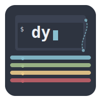

<div align="center">
  
  <h1>dy</h1>
  <p>A powerful, flexible, and efficient logging package for Go applications with advanced context handling and error correlation.</p>
  
  <div>
    <a href="https://pkg.go.dev/github.com/zakirkun/dy"></a>
    <a href="LICENSE"></a>
    <!-- <a href="https://github.com/zakirkun/dy/actions"></a> -->
    <a href="https://goreportcard.com/report/github.com/zakirkun/dy"></a>
  </div>
</div>

---

## ✨ Features

- 📊 **Multiple log levels**: DEBUG, INFO, WARN, ERROR, FATAL
- 🎨 **Customizable output format** with timestamps and prefixes
- 🔄 **Contextual logging** with inherited context chains
- 🔍 **Advanced error correlation** for rich debugging information
- 📌 **Function call tracing** with automatic indentation
- 📝 **Structured logging** with JSON output format
- 📂 **Caller information** (file, line, function)
- 🌈 **Colored output** for terminal environments
- 🔄 **Automatic log rotation** and backup management
- 📦 **Compressed log archives**
- 🔒 **Thread-safe operation**
- ⚡ **Low overhead** with level-based filtering
- 🌐 **Global default logger** and instance-based loggers

## 📦 Installation

```bash
go get github.com/zakirkun/dy
```

## 🚀 Basic Usage

```go
package main

import (
    "github.com/zakirkun/dy"
)

func main() {
    // Use the default logger
    dy.Info("This is an informational message")
    dy.Warn("This is a warning message")
    dy.Error("This is an error message: %s", "connection timeout")
    
    // Create a custom logger
    logger := dy.New(
        dy.WithPrefix("APP"),
        dy.WithLevel(dy.DebugLevel),
        dy.WithColor(true), // Enable colored output
    )
    
    logger.Debug("Debug message with color")
    logger.Info("Custom logger info message")
}
```

## 🔄 Contextual Logging

Create child loggers that automatically inherit context from parent loggers:

```go
// Base application logger
baseLogger := dy.New(dy.WithLevel(dy.InfoLevel))

// Create request-scoped logger with request ID
reqLogger := baseLogger.WithContext("request_id", "abc-123")
reqLogger.Info("Request received") // Logs with request_id=abc-123

// Create user-scoped child logger that inherits request context
userLogger := reqLogger.WithContext("user_id", "user-456") 
userLogger.Info("User authenticated") // Logs with request_id=abc-123 AND user_id=user-456

// Add multiple fields at once
txLogger := userLogger.WithFields(map[string]interface{}{
    "transaction_id": "tx-789",
    "amount": 99.95,
    "currency": "USD",
})
txLogger.Info("Transaction started") // Logs with ALL context values

// Remove sensitive context for certain logs
sanitizedLogger := txLogger.WithoutContext("user_id")
sanitizedLogger.Info("Metrics collected") // Logs without the user_id
```

## 🔍 Error Correlation

Automatically capture detailed error information in your logs:

```go
// Basic error logging
if err := db.Query("SELECT * FROM users"); err != nil {
    log.WithError(err).Error("Database query failed")
    // Automatically includes error message, type, and stack trace
}

// Add an error code
log.WithError(err).WithErrorCode("DB_CONN_FAILED").Error("Database connection error")

// Create and wrap errors with rich context
baseErr := errors.New("network timeout")
wrappedErr := dy.WrapError(
    baseErr,
    "API request failed", 
    "API_ERROR",
    map[string]interface{}{
        "endpoint": "/api/data",
        "timeout_ms": 500,
    }
)
log.WithError(wrappedErr).Error("External service unavailable")
```

Custom error types can implement interfaces to provide additional context:

```go
// Define a custom error type with extra context
type DBError struct {
    Err     error
    Query   string
    Params  []interface{}
}

func (e *DBError) Error() string {
    return fmt.Sprintf("database error: %s", e.Err)
}

func (e *DBError) Unwrap() error {
    return e.Err
}

// Implement Fields() to add contextual information
func (e *DBError) Fields() map[string]interface{} {
    return map[string]interface{}{
        "query":  e.Query,
        "params": fmt.Sprintf("%v", e.Params),
    }
}

// Implement Code() for error code
func (e *DBError) Code() string {
    return "DB_ERROR"
}

// When logged, all this additional information is captured
log.WithError(&DBError{
    Err:    sql.ErrNoRows,
    Query:  "SELECT * FROM users WHERE id = ?",
    Params: []interface{}{123},
}).Error("User not found")
```

## 🔄 Log Rotation

```go
package main

import (
    "time"
    "github.com/zakirkun/dy"
)

func main() {
    // Create a logger with file rotation
    logger := dy.New(
        dy.WithRotateWriter("logs/application.log", 
            dy.WithMaxSize(10),             // Rotate at 10MB
            dy.WithMaxBackups(5),           // Keep 5 old logs
            dy.WithBackupInterval(24*time.Hour), // Rotate daily
            dy.WithCompress(true),          // Compress old logs
        ),
        dy.WithLevel(dy.InfoLevel),
    )
    // It's important to close the logger to flush any buffered data
    defer logger.Close()
    
    logger.Info("Application started")
    
    // Log will automatically rotate when:
    // 1. File exceeds 10MB
    // 2. 24 hours have passed since last rotation
    // 3. Maximum 5 old log files will be kept
}
```

## 🌈 Colored Output

The logger supports colored output in terminal environments:

- 🔵 **DEBUG**: Blue
- 🟢 **INFO**: Green
- 🟡 **WARN**: Yellow
- 🔴 **ERROR**: Red
- 🟣 **FATAL**: Bold Red

Colors are automatically enabled by default when writing to a terminal (os.Stdout or os.Stderr) and can be toggled with the `WithColor` option.

## 📌 Function Call Tracing

```go
func processData() {
    // Log entry and exit of function with proper indentation
    defer dy.TraceFunction()()
    
    dy.Info("Processing data...")
    // Do work here
}
```

## 📝 JSON Output Format

```go
logger := dy.New(
    dy.WithJSONFormat(true),
    dy.WithCallerInfo(true),
)

logger.Info("This will be output in JSON format")
```

## ⚙️ Configuration Options

- `WithOutput(io.Writer)`: Set custom output destination
- `WithLevel(Level)`: Set minimum log level 
- `WithPrefix(string)`: Add a prefix to all log messages
- `WithTimestamp(bool)`: Enable/disable timestamps
- `WithTrace(bool)`: Enable/disable function call tracing
- `WithIndentString(string)`: Customize indentation for nested function calls
- `WithJSONFormat(bool)`: Enable/disable JSON format
- `WithCallerInfo(bool)`: Include caller file/line information
- `WithColor(bool)`: Enable/disable colored output

### 🔄 Context Options

- `WithContext(key, value)`: Create a logger with an additional context field
- `WithFields(map)`: Create a logger with multiple additional context fields
- `WithoutContext(key)`: Create a logger without a specific context field
- `WithError(err)`: Create a logger with rich error information
- `WithErrorCode(code)`: Add or update an error code

### 📦 Log Rotation Options

- `WithRotateWriter(filename, options...)`: Use rotating file output
  - `WithMaxSize(megabytes)`: Maximum file size before rotation
  - `WithMaxBackups(count)`: Maximum number of old log files to retain
  - `WithBackupInterval(duration)`: Time interval for regular rotation
  - `WithCompress(bool)`: Enable/disable gzip compression of old logs

## 🔍 Error Utilities

- `NewError(message, code, fields)`: Create a rich error with code and context fields
- `WrapError(err, message, code, fields)`: Wrap an existing error with additional context

## ⚡ Performance

The package is designed to be efficient:

- Minimal heap allocations
- Level-based message filtering before string formatting
- Concurrency-safe through mutex locking
- Benchmark suite included

## 📚 Examples

See the `example` folder for complete examples of usage.

## 🔧 Compatibility

- Requires Go 1.16 or later
- No external dependencies

## 📄 License

[MIT License](LICENSE)

## 👥 Contributing

Contributions are welcome! Feel free to submit issues or pull requests.